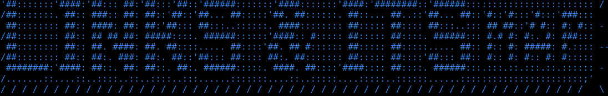

# Workspace for out-of-the-box Helios 16 P Deploy

This project aims to integrate the Robosense Helios 16 P on a Go1 Unitree robot dog.

§

---

# Content

This project borns as an applicative oriented project, here you will find two ready for building containers workspaces.
Actually the containers are for Kiss-ICP and for MOLA pipelines usage related to Robosense Helios16p LIDAR.

Every container workspace contains:

- The ros2 workspace helios16p_ws

- A passwd.txt for configuring your users passwords

- A build.sh script for building your container

- A run.sh script for running the container after having built it

- An entrypoint.sh to let you tune the container's boot

- An xml config file for Eclipse Cyclone DDS rmw
  actually if you use Eprosima Fast DDS, you can comment into the Dockerfile those lines that have been pointed out as necessary for Cyclone

- The dockerfile needed for the build, the golden image used is crossbuildable, keep in mind that the build.sh file will automatically build with your native architecture,
  if you want to override this aspect there is a declared variable for this purpose.

---

# § Helios16p Kiss-ICP 

## § Helios16p Kiss-ICP Workspace structure 

In the helios16p_ws workspaces there are the following packages:

rslidar_msg (https://github.com/RoboSense-LiDAR/rslidar_msg)

rslidar_sdk (https://github.com/RoboSense-LiDAR/rslidar_sdk)

kiss_icp (https://github.com/PRBonn/kiss-icp) 

helios16p_cane_robot (custom wrapper package)

pointcloud_to_laserscan (fork of https://gitlab.epfl.ch/create-lab/robocup_at_home/epfl-robocup/-/tree/v1.0/pointcloud_to_laserscan)

go1_description (https://github.com/unitreerobotics/unitree_ros/tree/master/robots/go1_description)

vicon_receiver (https://github.com/OPT4SMART/ros2-vicon-receiver)

ros2_unitree_legged_msgs (https://github.com/unitreerobotics/unitree_ros_to_real/tree/master/unitree_legged_msgs)

unitree_legged_real (fork of https://github.com/unitreerobotics/unitree_ros_to_real/tree/master/unitree_legged_real)

unitree_nav_interfaces (https://github.com/ngmor/unitree_nav/tree/main/unitree_nav_interfaces)

unitree_nav (fork of https://github.com/ngmor/unitree_nav)

---

## § Packages functions 

rslidar_msg: Contains the msg structure that rslidar_sdk expects.

rslidar_sdk: Contains the drivers of Helios 16 P lidar, they are handled by the node rslidar_sdk_node.

kiss_icp: Contains the odometry SLAM pipeline with a personalized configuration of Rviz for a better visualization of the ongoing matters.

helios16p_cane_robot: Contains a launch file, a series of yaml config files and an urdf model with xacro syntax, be sure to install xacro throught pip before attempting to load it. 

pointcloud_to_laserscan: Computes /rslidar_points topic and outputs the /scan topic, containing the laserscan necessary to let the go1 navigate throught NAV2.

go1_description: A fork of the project located at https://github.com/unitreerobotics/unitree_ros, with a demo launch file ready for use.

vicon_receiver: Needed if vicon sensor trajectory recording is required.

ros2_unitree_legged_msgs: Defines ros2_unitree_legged messages structure.

unitree_legged_real: Contains necessary to spin up a bridge between Rpi4 nd go1's MCU, enabling internal odom and imu values.

unitree_nav_interfaces: Defines the interfaces needed by the unitree_nav package.

unitree_nav: Needed to convert twist type msgs to HighCmd type msgs and send them to the cmd_vel topic, enabling nav2 navigation.

Actually for bare deployment purposes, you can remove go1_description and vicon_receiver, they are included here as the helios16p_cane_robot includes two dedicated launch files
for out-of-the-box usage. Anyway those files are already excluded from Dockerfile, to keep everything lean.

---

## § Launch file parameters 

The launch file actually has the following parameters: 

- simulate:=True/False -> its a flag to enable or disable the simulated environment, to enable it you first require a ros bag.
                          Its set by default to False.

- bagfile:='<your/bag/path>' -> it allows you to set a different path for your bag file.

- state_publisher:=True/False -> it enables the robot_state_publisher, its True by default but can be turned False for edge applications..

- nomap:=True/False -> it disables map -> odom tf, its False by default.

- visualize:=True/False -> it enables Rviz visualization, its False by default and its recommended so for performances.

- visualize_clouds:=True/False -> it enables Rviz visualization, its False by default and assumes the "visualize" value, turn it true if you have to debug kiss-icp topics.

- max_range:=<double> -> it allows you to set the maximum threshold before which the collected points are computed.

- min_range:=<double> -> it allows you to set the minimum threshold by which the collected points are computed.

- mapping_voxel_size:=<double> -> it allows you to set the edge lenght of the voxel.

- mapping_voxel_points:=<double> -> it allows you to set the max number of points per voxel.

- data_deskew:=True/False -> it allows you to enable frame deskewing, by default its set True.

- base_frame:=<str> -> it allows you to set the base frame's name.

- lidar_odom_frame:=<double> -> it determines the odometry frame's name, by default its set as "odom".

- publish_odom_tf:=True/False -> it determines if odometry has to be published, by default its set True.

- invert_odom_tf:=True/False -> it allows you to invert the transform, by default its set False.

- max_num_iterations:=<int> -> it allows you to set the maximum number of iteractions allowed for reaching the convergence threshold.

- convergence_criterion:=<float> -> it allows you to set the convergence threshold, default value is 0.0001.

Their default values can be set in the launch file's def generate_launch_description.
These parameters are included exclusively for debugging and testing, for a complete list of all parameters, refer to the launch files.

If you want to load a certain configuration, please,
change the **default_config_file_path** variable path or load it with **ros2 param load <file_path>* .

For granular tuning as for movement thresholds, use yaml config files included.

---

## § Configuration files 

The folder "configs" of helios16p_cane_robot package holds a number of stable and semi-stable configurations for an out-of-the-box use.

Actually the stablest configurations included are:

[STABLE]
mrange 5, 6, 7, 8, 9, 10, 15, 20, 25, 30 and the base 100 config [m]

Keep in mind that if you want to change configurations,
you'll might want to change the distance thresholds into the lidar configuration file(same folder as other config files),
as reducing the pipeline threshold without doing the same with the LiDAR one could burden unnecessarily your maps.

Here are listed the specs of CPU used for kiss-icp tuning, keep in mind that those configurations said stable could be otherwise with your hardware.

Architecture:             x86_64
  CPU op-mode(s):         32-bit, 64-bit
  Address sizes:          43 bits physical, 48 bits virtual

CPU(s):                   8
- On-line CPU(s) list:    0-7

Model name:             AMD Ryzen 5 3450U with Radeon Vega Mobile Gfx
- CPU family:           23
- Model:                24
- Thread(s) per core:   2
- Core(s) per socket:   4
- Socket(s):            1
- Stepping:             1
- Frequency boost:      enabled
- CPU max MHz:          2100.0000
- CPU min MHz:          1400.0000
- BogoMIPS:             4192.31

---

## § Launch description 
 
The launch file actually contains the following nodes:

**NODE** | robot_state_publisher: Displays the urdf, accordingly to frames.

**NODE** | static_transform_map_to_odom: Powered by tf2,
	# sends the static transform of the map to odom frame.

**NODE** | static_transform_odom_to_base_link: Powered by tf2, 
	# sends the static transform of odom to the base_link frame.

**NODE** | static_transform_base_link_to_rslidar: Powered by tf2, 
	# sends the static transform of odom to the lidar's rslidar frame.

**PROCESS** | startmybag: Its a ROS 2 command that start a bag loop, 
              with the correct time clock to prevent simulation blockage due to incorrect datastamps.
              Note: This process will be executed only if the simulation flag is set true.

**LAUNCH** | unitree_legged_real_launch: Starts the udp_high, jsp_high and cmd_processor nodes throught a modified launch located inside the unitree_legged_real package.

**NODE** | rslidar_sdk: Starts the driver handler, opening the topic rslidar_points where lidar data will be received.
         **Note:* This process will be executed only if the simulation flag is set false.

**LAUNCH** | pointcloud_to_laserscan_launch: Starts the pointcloud_to_laserscan node throught a modified launch located inside the relative pointcloud_to_laserscan package.
         **Note:* Remember to edit the launch file accordingly to your lidar's pointcloud.

**NODE** | kiss_icp: Starts the pipeline for converting lidar data to odometry.

**NODE** | rviz2: Starts a preconfigured, working out of the box rviz2 session,
           equipped with visual data, visual odometry and visual mapping.

---

## § Behaviour 

If simulate is flagged true:

- The lidar drivers handler node won't start.

- The ROS bag you specified will be loop-played, with a fake clock for your rviz2 session.

- Kiss_icp pipeline will start running, sending odometry data to /kiss/pose topic.

- The rviz2 session will start with a custom config file and it'll show the raw data visualization with a odometry and mapped data output as well.

if simulate is flagged false:

- The lidar drivers handler node will start.

- The ROS bag you specified will be ignored.

- Kiss_icp pipeline will start running, sending odometry data to /kiss/pose topic.

- The rviz2 session will start with a custom config file and it'll show the raw data visualization with a odometry and mapped data output as well.

---

## § Building 

Its necessary, if building from scratch is needed, to build firstly rslidar_msg, ros2_unitree_legged_msgs and unitree_nav_interfaces packages as they're required by the others to build effectively.

---

## § Benchmark for Kiss-icp

In this section i'll show you the results of benchmarks related to the various configs offered in this package, specifically the range [5, 10] as its the more affected by the reduced max_range parameter and so its also more prone to angular error increase.

The datasets used have been produced for this purpose and will be accessible in the future.

The tool used for comparations of cinematic curves is EVO, as its a standard.

The following are the trajectories used for the comparison:

*Linear (L)*:
duration (s)    73.40
nr. of poses    3816
path length (m) 24.5491

*Inclinations (I)*:
 duration (s)    77.04
 nr. of poses    5064
 path length (m) 8.4849

*Rotations (R)*:
duration (s)    44.16
nr. of poses    2782
path length (m) 6.8828

*Inclinations and Rotations (Ir)*:
duration (s)    130.85
nr. of poses    8235
path length (m) 13.7381

*Snake-like (S)*:
 duration (s)    141.80
 nr. of poses    9018
 path length (m) 47.4038
 
*Variety (V)*:
 duration (s)    219.22
 nr. of poses    13978
 path length (m) 40.2368

-----| *(L)* | *(L)* | *(I)* | *(I)* | *(R)* | *(R)* | *(Ir)*| *(Ir)*| *(S)* | *(S)* | *(V)* | *(V)*
-----|-------|-------|-------|-------|-------|-------|-------|-------|-------|-------|-------|-------
-----| RTE % | ATE % | RTE % | ATE % | RTE % | ATE % | RTE % | ATE % | RTE % | ATE % | RTE % | ATE % 
 5   | 0.181 | 0.435 | 0.523 | 1.258 | 0.427 | 0.947 | 0.180 | 0.716 | 0.121 | 1.245 | 0.142 | 2.489 
 6   | 0.213 | 2.937 | 0.566 | 1.319 | 0.395 | 0.916 | 0.350 | 0.815 | 0.119 | 1.211 | 0.174 | 0.931 
 7   | 0.216 | 2.947 | 0.573 | 1.287 | 0.384 | 0.938 | 0.264 | 0.600 | 0.128 | 1.222 | 0.176 | 0.912 
 8   | 0.215 | 2.947 | 0.572 | 1.307 | 0.379 | 0.935 | 0.253 | 0.597 | 0.143 | 1.214 | 0.186 | 1.056 
 9   | 0.215 | 2.951 | 0.606 | 1.636 | 0.367 | 0.942 | 0.248 | 0.607 | 0.144 | 1.204 | 0.096 | 2.527 
 10  | 0.214 | 2.961 | 0.534 | 1.288 | 0.326 | 0.949 | 0.139 | 0.779 | 0.140 | 1.473 | 0.142 | 2.328 
 100 | 0.224 | 2.955 | 0.630 | 1.597 | 0.353 | 0.982 | 0.259 | 0.665 | 0.177 | 1.223 | 0.237 | 0.887 

---

## § Next steps 

Soon there will be:

- Better kiss-icp configurations with more detailed and trustworthy values for different borderline config sets

- Docker compose files for out-of-the-box deployment inside go1.

---

## § Infos on the project 

This project is currently a cooperational project led by Links Foundation and ITS Meccatronica e Aerospazio Piemonte (MAP).

